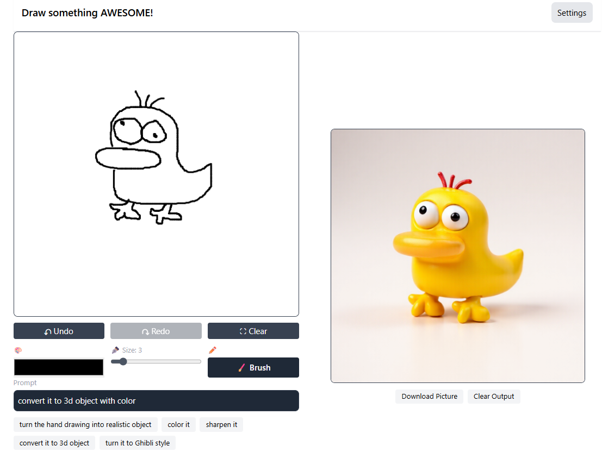

# Draw Something AWESOME!
ai agent powered drawing board

## backend
```
python backend.py
```

## frontend
```
npm run dev
```

## project structure

project/
├── 📄 README.md                    # This file
├── 🔧 backend.py                   # Backend api/endpoint
├── 🔐 .env.example                 # Environment template
├── 📦 requirements.txt             # Python dependencies
│
├── 📁 frontend/src/                    # Core framework
│   ├── 🤖 agents/                  # Agent implementations
│   ├── 🛠️ tools/                   # Built-in tools
│   ├── 🧠 llm/                     # LLM providers & management
│   └── 🔌 mcp/                     # MCP tool examples
│
└── 📁 tests/                       # Test suite
    ├── 🧪 test_agents.py
    └── 🧪 test_tools.py


